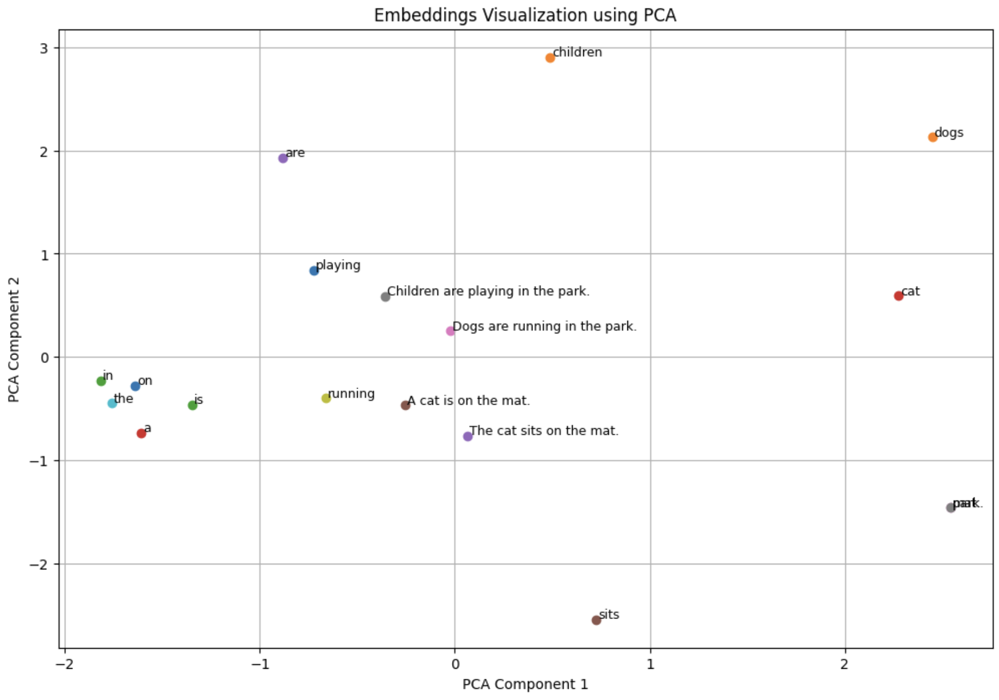

### Token Embeddings: Capturing Word Meanings

Token embeddings represent individual words as dense vectors of numbers. These vectors capture the semantic meaning of words based on their usage in large text corpora. For example, the word "cat" might be represented by a 50-dimensional vector that encodes information about its context and relationship with other words. Using pre-trained models like GloVe, these embeddings are learned from extensive text data, ensuring they capture a wide range of word meanings and similarities.

### Sentence Embeddings: Representing Whole Sentences

Sentence embeddings extend the idea of token embeddings to whole sentences. Instead of representing individual words, sentence embeddings capture the overall meaning of a sentence. This is typically done by averaging the embeddings of all the words in the sentence. For instance, the sentence "The cat sits on the mat." can be represented by averaging the vectors of "the," "cat," "sits," "on," and "mat." This approach allows the sentence to be represented as a single dense vector that encodes its overall meaning.

### Visualization: Comparing Token and Sentence Embeddings

To visualize the embeddings, we can reduce their dimensionality using PCA and plot them in a 2D space. In the provided code, we load pre-trained GloVe embeddings and use them to create both token and sentence embeddings. By applying PCA, we reduce the 50-dimensional vectors to 2 dimensions, making it easier to plot and compare them. The resulting plot shows the relationships between individual words and entire sentences, highlighting how similar words and sentences cluster together.

### Summary Table

| Concept                 | Description                                                                    | Example                                       |
| ----------------------- | ------------------------------------------------------------------------------ | --------------------------------------------- |
| **Token Embeddings**    | Dense vectors representing individual words.                                   | "cat" -> [0.2, -0.1, ...]                     |
| **Sentence Embeddings** | Dense vectors representing entire sentences by averaging token embeddings.     | "The cat sits on the mat." -> [0.1, 0.0, ...] |
| **Visualization**       | Reducing dimensionality for easier comparison and understanding of embeddings. | 2D scatter plot showing relationships         |
