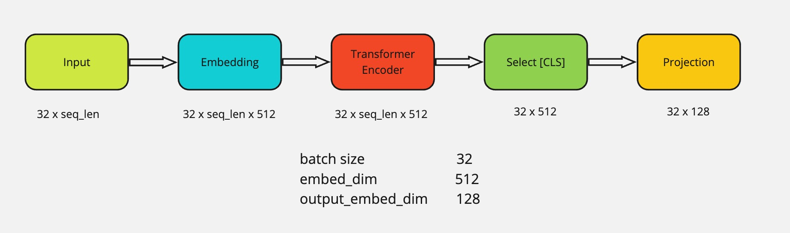
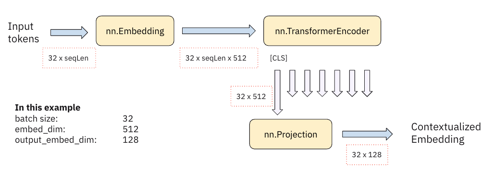

# Inference Dual Encoder for Matching Questions and Answers

## Using DPR Encoders for Questions and Answers

The Inference Dual Encoder uses Dense Passage Retrieval (DPR) encoders to match questions with relevant answers. It relies on two pre-trained models:

- **DPRContextEncoder**: Encodes answers.
- **DPRQuestionEncoder**: Encodes questions.

These models transform text into dense vectors, facilitating the comparison between questions and potential answers by measuring their similarity.

## Calculating Similarity Using Cosine Similarity Matrix

The cosine similarity matrix is employed to compare encoded vectors. The process includes:

- **Normalization**: Vectors are normalized.
- **Inner Product**: The inner product between normalized vectors is computed.
- **Similarity Scores**: Scores are rounded to identify the closest match based on the highest score.

This approach ensures the selection of the most relevant answer by comparing similarity scores.

## Training Dual Encoder Models with Question-Answer Pairs

Two BERT-based models are fine-tuned to generate meaningful embeddings for questions and answers using a dataset of question-answer pairs. The training process involves:

- **Contrastive Loss**: Used to maximize similarity for correct pairs and minimize it for incorrect pairs.
- **Embedding Generation**: Question and answer encoders produce fixed-size embeddings.
- **Dot Product Operation**: Calculates similarity scores.

The contrastive loss function penalizes incorrect matches and rewards correct ones, improving the model's ability to generate accurate similarity scores.

### Model Training Steps

1. **Input Tokens**: Tokens are embedded.
2. **Transformer Encoder**: Processes the embeddings.
3. **Projection**: Projects the output to a fixed-size embedding.

## Dataset, Input, and Output for Training and Inference

The training dataset comprises numerous question-answer pairs used over multiple epochs to fine-tune the model parameters. The inputs and outputs for the model include:

- **Input**:
  - A list of possible answers.
  - A single question.
- **Output**:
  - The answer with the highest similarity score.

This setup ensures the model can effectively handle question-answer matching tasks.

## Results and Model Performance Evaluation

The model's performance is evaluated by comparing similarity scores for different question-answer pairs. The expected outcomes include:

- **High Similarity Scores**: For identical or semantically similar pairs.
- **Low Similarity Scores**: For unrelated pairs.

### Example Evaluation

**Question**: "What is the tallest mountain in the world?"

**Answers**:
| Answer | Similarity Score |
| ------ | ---------------- |
| "What is the tallest mountain in the world?" | 1.0844 |
| "The tallest mountain in the world is Mount Everest." | 2.3333 |
| "Who is Donald Duck?" | -0.634 |

### Inference Result

The model correctly identifies "The tallest mountain in the world is Mount Everest" as the best answer, showing its capability to accurately generate similarity scores and handle question-answer matching scenarios. Despite having the question itself as one of the candidate answers, it correctly identifies that the question itself cannot be the answer to the question!
