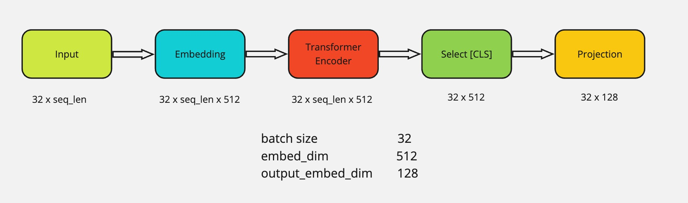
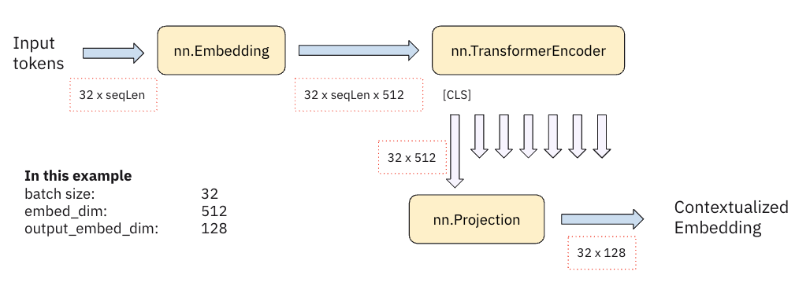
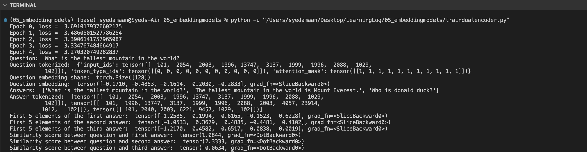

Aim is to train two separate BERT-based models to generate meaningful embeddings for questions and answers. These embeddings enable the comparison of the semantic similarity between a given question and multiple possible answers. By using contrastive loss during training, the model learns to maximize the similarity score for correct question-answer pairs and minimize it for incorrect pairs. This project uses a dataset of question-answer pairs and involves multiple training epochs to fine-tune the model parameters.

During training, the question and answer encoders process their respective inputs and produce fixed-size embeddings. These embeddings are then used to calculate similarity scores through a dot product operation. The contrastive loss function guides the training process by penalizing incorrect matches and rewarding correct ones, thereby improving the model's ability to generate accurate similarity scores over time. After training, the dual encoder can be used to evaluate new question-answer pairs and determine their semantic similarity.

The performance of the trained model is evaluated by comparing the similarity scores for different question-answer pairs. The expected outcome is that identical or semantically similar pairs have high similarity scores, while unrelated pairs have low scores. The model's effectiveness is verified by running multiple tests and ensuring the scores align with the expected semantic relationships.

### result

Question: "What is the tallest mountain in the world?"

Answers:
"What is the tallest mountain in the world?" (Same as question, it is not the correct answer)
**similarity score: 1.0844**

"The tallest mountain in the world is Mount Everest." (Correct answer, should be similar)
**similarity score: 2.3333**

"Who is Donald Duck?" (Irrelevant, should be dissimilar)
**similarity score: -0.0.634**

Our model correctly says that the second option is the correct answer to the question. despite the question itself being one of the other two options!
