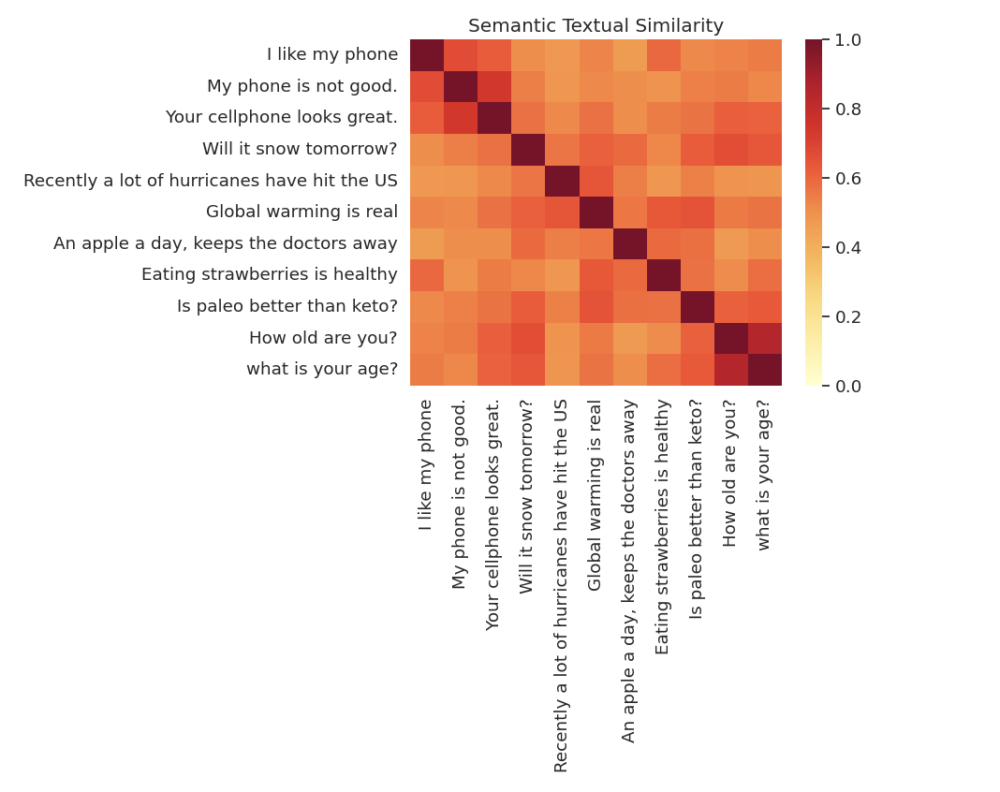
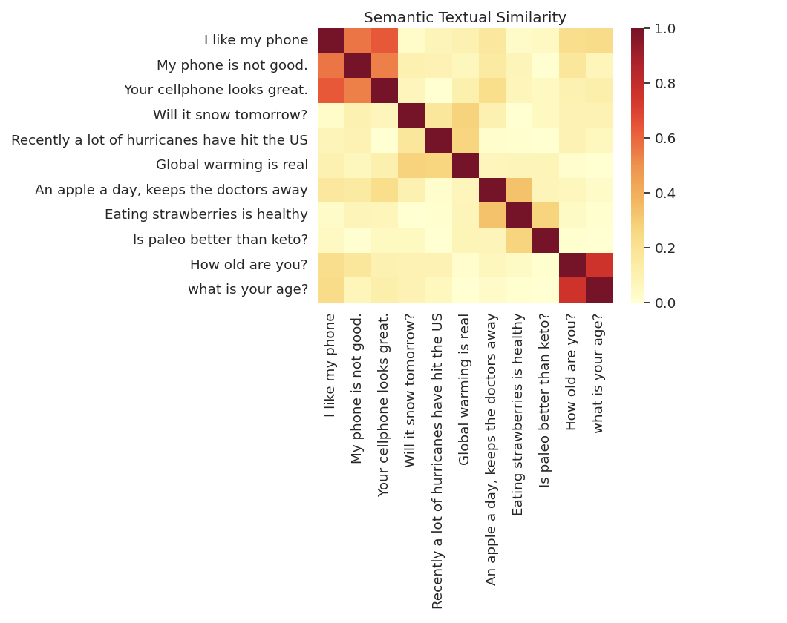

### Token Embeddings: Individual Word Representations

Token embeddings represent each word in a sentence as a unique vector in a high-dimensional space. These vectors capture the context of words by considering their surrounding words. The input is typically a single word or token, and the output is a vector specific to that word. For example, the word "bank" in "river bank" will have a different embedding than "bank" in "savings bank" because the surrounding context is different.

- **Input:** Single words or tokens.
- **Output:** Individual vector representations for each token.

### Sentence Embeddings: Holistic Sentence Representations

Sentence embeddings, on the other hand, represent entire sentences as single vectors. These embeddings consider the overall meaning of the sentence rather than focusing on individual words. The input is a full sentence, and the output is a single vector that encapsulates the sentence's meaning. This method is useful for tasks that require understanding the complete sentence, such as sentiment analysis or sentence similarity.

- **Input:** Full sentences.
- **Output:** Single vector representations for the entire sentence.

### Comparison and Use Cases

Token embeddings are useful for tasks that require understanding the role of individual words in context, such as Named Entity Recognition (NER) or Part-of-Speech (POS) tagging. Sentence embeddings are better suited for tasks that need to understand the meaning of entire sentences, such as text classification or semantic textual similarity. Both types of embeddings are essential in Natural Language Processing (NLP) and are often used together in more complex models.

| Embedding Type | Input          | Output                            | Use Case                                 |
| -------------- | -------------- | --------------------------------- | ---------------------------------------- |
| Token          | Single words   | Vectors for each word             | Named Entity Recognition, POS tagging    |
| Sentence       | Full sentences | Single vector for entire sentence | Text classification, Semantic similarity |
